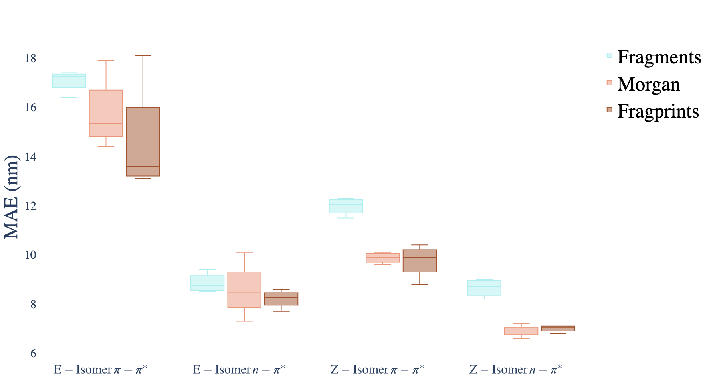

# The Photoswitch Dataset

[](LICENSE)
[](https://zenodo.org/badge/latestdoi/232307189)


This repository provides benchmarked property prediction results on a curated dataset of 405 photoswitch molecules. 

<p align="center">
  
</p>

## Installation

We recommend using a conda virtual environment.

```
conda create -n photoswitch python=3.7

conda install -c conda-forge rdkit

conda install seaborn xlrd matplotlib ipython pytest pytorch scikit-learn pandas

pip install git+https://github.com/GPflow/GPflow.git@develop#egg=gpflow

pip install dgl dgllife jupyter gpflux umap-learn

git clone https://github.com/hyperopt/hyperopt-sklearn.git
cd hyperopt-sklearn
pip install -e .
```

## Property Prediction

To reproduce the property prediction results, run a model prediction script using the task flag to specify the 
appropriate task (e_iso_pi, e_iso_n, z_iso_pi, z_iso_n) corresponding to different electronic transition wavelengths e.g.

```bash
python  predict_with_GPR.py -task e_iso_pi                    
```

| Metric  | GPR-Tanimoto + Fragprints |
| ------------- | ------------- |
| RMSE  | 20.9 nm |
| MAE  | 13.3 nm  |
| R<sup>2</sup>  | 0.90  |

## Prediction Error as a Guide to Representation Selection

Prediction errors under different model/representation combinations may be analyzed in the context of the property being
predicted.

<p align="center">
  
</p>

The following boxplot shows shows the performance of each molecular representation
aggregated across the Random Forest, Gaussian Process, Multioutput Gaussian Process
and Attentive Neural Process models.

<p align="center">
  
</p>

## TD-DFT Comparison

For the comparison with Time-Dependent Density Functional Theory (TD-DFT) run the DFT comparison script specifying the
level of theory to compare against using the theory level flag (CAM-B3LYP or PBE0) e.g.

```bash
python  dft_comparison_with_GPR.py -theory_level CAM-B3LYP                        
```

| Metric  | GPR-Tanimoto + Fragprints | CAM-B3LYP TD-DFT | CAM-B3LYP + Linear |
| ------------- | ------------- | ------------- | ------------- |
| MAE  | 14.9 nm | 16.5 nm | 10.7 nm |

```bash
python  dft_comparison_with_GPR.py -theory_level PBE0                        
```

| Metric  | GPR-Tanimoto + Fragprints | PBE0 TD-DFT | PBE0 + Linear |
| ------------- | ------------- | ------------- | ------------- |
| MAE  | 15.2 nm | 26.0 nm | 12.4 nm |

## Human Performance Comparison

To reproduce the model prediction errors for the human performance comparison, run the following script:

```bash
python  human_performance_comparison.py                        
```

<p align="center">
  
</p>


## Generalization Error

To reproduce the generalization error results, run the following scripts:

```bash
python  generalization_error.py -augment_photo_dataset False                        
```

| Metric  | RF + Fragprints |
| ------------- | ------------- |
| RMSE  | 85.2 nm |
| MAE  | 72.5 nm  |
| R<sup>2</sup>  | -0.66  |

```bash
python  generalization_error.py -augment_photo_dataset True                        
```

| Metric  | RF + Fragprints |
| ------------- | ------------- |
| RMSE  | 36.9 nm |
| MAE  | 22.7 nm  |
| R<sup>2</sup>  | 0.67  |

## Data Visualization

Run 

```bash
python  visualization.py                       
```

to obtain an (unannotated) visualization of the Photoswitch Dataset

<p align="center">
  
</p>

## What We Provide

The dataset includes molecular properties for 405 photoswitch molecules. 
All molecular structures are denoted according to the simplified molecular input line entry system (SMILES). We collate
the following properties for the molecules:

**Rate of Thermal Isomerization** (units = s^-1): This is a measure of the thermal stability of the least stable 
isomer (Z isomer for non-cyclic azophotoswitches and E isomer for cyclic azophotoswitches). Measurements are carried out 
in solution with the compounds dissolved in the stated solvents.

**Photostationary State** (units = % of stated isomer): Upon continuous irradiation of an azophotoswitch a 
steady state distribution of the E and Z isomers is achieved. Measurements are carried out in solution with the 
compounds dissolved in the ‘irradiation solvents’.

**pi-pi-star/n-pi-star wavelength** (units = nanometers): The wavelength at which the pi-pi*/n-pi* electronic transition 
has a maxima for the stated isomer. Measurements are carried out in solution with the compounds dissolved in the 
‘irradiation solvents’.

**DFT-computed pi-pi-star/n-pi-star wavelengths** (units = nanometers): DFT-computed wavelengths at which the
pi-pi*/n-pi* electronic transition has a maxima for the stated isomer.

**Extinction coefficient**: The molar extinction coefficient.

**Wiberg Index**: A measure of the bond order of the N=N bond in an azophotoswitch. Bond order is a measure of the 
‘strength’ of said chemical bond. This value is computed theoretically.

**Irradiation wavelength**: The specific wavelength of light used to irradiate samples from E-Z or Z-E such that 
a photo stationary state is obtained. Measurements are carried out in solution with the compounds dissolved in the 
‘irradiation solvents’.

## Gaussian Process Regression using a Tanimoto Kernel

Please see the examples folder for a tutorial on how to implement and use the GP-Tanimoto model in GPflow.

## Citing the Photoswitch Dataset

If you find the Photoswitch Dataset useful for your research, please consider citing the following article.

```
@article{2022Griffiths,
  title={Data-driven discovery of molecular photoswitches with multioutput Gaussian processes},
  author={Griffiths, Ryan-Rhys and Greenfield, Jake L and Thawani, Aditya R and Jamasb, Arian R and Moss, Henry B and Bourached, Anthony and Jones, Penelope and McCorkindale, William and Aldrick, Alexander A and Fuchter, Matthew J and others},
  journal={Chemical Science},
  volume={13},
  number={45},
  pages={13541--13551},
  year={2022},
  publisher={Royal Society of Chemistry}
}
```
